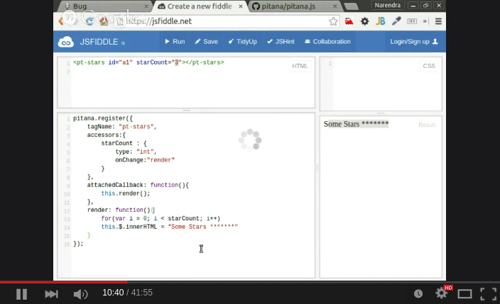

# pitana.js
Small Library on top of webcomponents.js for creating Reusable Custom Elements.

# FAQ

* WTF? Again a new Framework for JavaScript ! :(
    * Well, Its not a Framework, it is small Utility library to create Custom Elements. 
    You can use this library with existing code (conditions apply)
* What? Custom Elements ?
    * Yes, Webcomponents.js provide Polyfills for Custom Elements, HTML Imports and Shadow DOM.
* So, Can I use this library with my existing Frameworks & CodeBase.
    * You can use this library with react.js, backbone.js, and all possible frameworks and libraries.
    * Yes, All you need to load - webcomponents-lite.min.js (36KB) + pitana.min.js (8KB)
    * Basic knowledge of WebComponents
    * Only supported in Modern Browser.
* But, Wait, Google has Polymer for creating Reusable Custom Elements, has lots of features. Why not use that ?
    * Yes, if you like Polymer then use it. But there are many who want to create custom Elements using Vanilla JS
    * For example - Mozilla created Brick (https://github.com/mozbrick/brick) which is written in Vanilla JS
    * Pitana.js a tiny Wrapper Library which gives backbone.js type syntax for creating Vanilla JS Custom Elements.
    * The closest alternate library is x-tags ( https://github.com/x-tag/core ) which has more features.
* So what are the features ?
    * Sweet Syntax like backbone views.
    * Sandbox approach.
    * Events bus for Element to Element communication.
    
* Should I use it or not ?
    * Checkout some Elements created using pitana.js, If you like them, then use them and 
    try to create some new Custom Element using pitana.js.
    
* What is the meaning of pitana ?
    * it is just a randomly created word.


#Watch Video 
[](https://www.youtube.com/watch?v=gI0un44VQoA)


<iframe width="560" height="315" src="https://www.youtube.com/embed/gI0un44VQoA" frameborder="0" allowfullscreen></iframe>

# Syntax

* Yes, We have some Sweet syntax - You can compare
      * progress-bar element using Vanilla JS
         * https://github.com/nsisodiya/boot-progressbar/blob/gh-pages/src/boot-progressbar.js
      * Same progressbar Element written again with pitana.js
         * https://github.com/pitana/pt-progressbar/blob/master/src/pt-progressbar.js
# Documentation

## How to register custom element ```pitana.register```
```js
pitana.register({
    tagName: "hello-world",
    attachedCallback: function () {
        //Do something
    }
});
```
## How to add template string  ```template```

* template as string
```js
pitana.register({
    tagName: "hello-world",
    template: "<h1>This is the template string</h1>"
});
```

* template as function

```js
pitana.register({
    tagName: "hello-world",
    template: function(){
        return "<h1>This is the template string</h1>"
    }
});
```
or
* It can be a template Node

```js
pitana.register({
    tagName: "hello-world",
    template: document.querySelector("template#helloworldTemplate")
});
```


## How to listen  ```events```

```js
pitana.register({
    tagName: "hello-world",
    events: {
        "click button#asd":"onClickButton"
    },
    template: "<p>Hello World, Click button to See more</p><button id='asd'>Click Me<button>",
    onClickButton: function(){
        window.alert("I wish you, Very Happy New Year");
    }
});
```

## How to use  ```accessors```

```html
    <pt-stars id="mystars" count="5"></pt-stars>
```

```js
pitana.register({
    tagName: "pt-stars",
    accessors: {
        count: {
            type: "int",
            onChange: "render"
        }
    },
    attachedCallback: function(){
        this.render();
    },
    render: function(){
        var str = "";
        var count = this.$.count;
        for(var i=0; i< count; i++){
            str = str + "*";
        }
        this.$.innerHTML = str;
    }
});
```

```js
    window.alert("The current value of Stars are" + document.getElementById("mystars").count )
```


## How to use pub/sub API for element to element communication.

Element ```pt-stars``` send signal to other elements 

```js
pitana.register({
    tagName: "pt-stars",
    accessors: {
        count: {
            type: "int",
            onChange: "render"
        }
    },
    attachedCallback: function(){
        this.render();
    },
    render: function(){
        this.publishGlobalEvent("STARS_CHANGED", this.$.count);
        var str = "";
        var count = this.$.count;
        for(var i=0; i< count; i++){
            str = str + "*";
        }
        this.$.innerHTML = str;
    }
});
```

```js
pitana.register({
    tagName: "pt-notifier",
    globalEvents:{
        "STARS_CHANGED":"onChangeStars"
    },
    template:"This is just a notifier element",
    onChangeStars: function(val){
        window.alert("We have noticed that value of stars changed to " + val);
    }
});
```

# Hello World Example

Code available at  - http://jsfiddle.net/nsisodiya/qr2obwyc/ 
### Task
```html
<hello-world name="James" count="5"></hello-world>
```
### index.html

```html
<h1>Pitna Hello World Element Demo</h1>
<button onclick="document.getElementById('tag').count=3">Change Count to 3</button>
<hello-world id="tag" name="James" count="5"></hello-world>
```
### js

```js
pitana.register({
    tagName: "hello-world",
    accessors: {
        name: {
            type: "string"
        },
        count: {
            type: "int",
            onChange: "attachedCallback"
        }
    },
    attachedCallback: function () {
        var s = [];
        for (var i = 0; i < this.$.count; i++) {
            s.push("<p>Hello " + this.$.name + "</p>");
        }
        this.$.innerHTML = s.join("");
    }
});
```

# Current List of Custom Element created using pitana.js

* ```pt-progressbar```
   * Bootstraped inspired progressbar
   * Demo - http://pitana.github.io/pt-progressbar
   * SourceCode - https://github.com/pitana/pt-progressbar/blob/master/src/pt-progressbar.js
* ```pt-pdfslideshow```
   * Pdf.js based Pdf Slideshow Element
   * Demo - http://pitana.github.io/pt-pdfslideshow
* ```pt-steps-indicator```
   * small widget for steps indicator
   * Demo - http://pitana.github.io/pt-steps-indicator
   * SourceCode - https://github.com/pitana/pt-steps-indicator/blob/master/src/pt-steps-indicator.js


# How to add your custom element in the above list

* Create customElement using pitana.js and file a bug(issue) on this repo.
